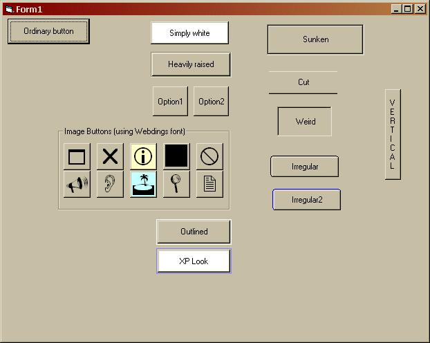

## Custom buttons using only VB intrinsic controls \(now with code :\)\)

### Description

Make cool custom buttons using only VB intrinsic controls. 13 types of buttons. Check out the screenshot.
 
### More Info
 

             |
---                |---
**Submitted On**   |2002-03-27 17:24:02
**By**             |[Janekk](https://github.com/Planet-Source-Code/PSCIndex/blob/master/ByAuthor/janekk.md)
**Level**          |Beginner
**User Rating**    |4.1 (49 globes from 12 users)
**Compatibility**  |VB 4\.0 \(32\-bit\), VB 5\.0, VB 6\.0, VBA MS Access, VBA MS Excel
**Category**       |[Custom Controls/ Forms/  Menus](https://github.com/Planet-Source-Code/PSCIndex/blob/master/ByCategory/custom-controls-forms-menus__1-4.md)
**World**          |[Visual Basic](https://github.com/Planet-Source-Code/PSCIndex/blob/master/ByWorld/visual-basic.md)
**Archive File**   |[Custom\_but658603272002\.zip](https://github.com/Planet-Source-Code/janekk-custom-buttons-using-only-vb-intrinsic-controls-now-with-code__1-33119/archive/master.zip)

